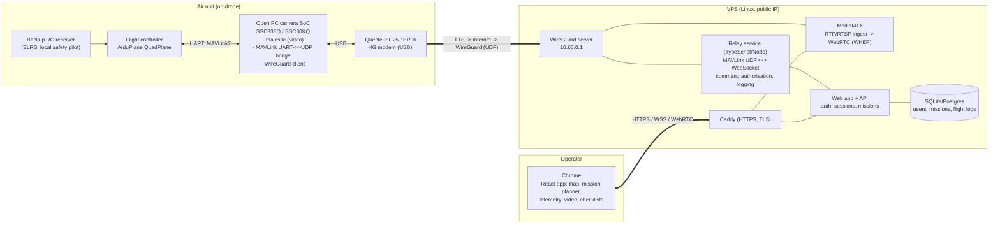

# Architecture

## Goal

A fixed-wing VTOL drone (ArduPlane QuadPlane) that flies **autonomous missions**. It is commanded and monitored over a **cellular (4G/LTE)** link from a **password-protected web app in Chrome**.

The communication side is based on the **OpenIPC 4G / QuadroFleet** approach: an OpenIPC IP-camera SoC with a Quectel modem and a WireGuard VPN.

## The key constraint

QuadroFleet's ground station is a **native app** (Windows, Linux or Android). It joins the WireGuard VPN and sends raw UDP. **Chrome can't do either.** The design therefore puts a **cloud relay server** between the drone and the browser:

- The drone talks to the server over WireGuard and UDP. This is the QuadroFleet-style path.
- The browser talks to the server over HTTPS, WebSocket and WebRTC. These are browser-native.

## Diagram

## Data paths

| Path | Transport | Notes |
|---|---|---|
| Telemetry (FC → browser) | FC UART MAVLink2 → camera bridge → UDP over WG → relay → WebSocket | Relay parses MAVLink and forwards only what the UI needs, rate-limited (for example 5–10 Hz for attitude and position). |
| Commands (browser → FC) | WebSocket → relay (auth + validation) → UDP over WG → camera → UART | Only a **whitelist** of commands is allowed, including mission upload, mode changes and RTL/QLAND. Arm and takeoff need explicit confirmation. |
| Mission upload | MAVLink mission protocol, driven by the **relay** (not the browser) | The relay handles retries and timeouts. The browser just submits a mission JSON. |
| Video (camera → browser) | majestic RTP over WG → MediaMTX → WebRTC (WHEP) | **Prefer H.264** for universal Chrome decode. H.265 saves bandwidth, but WebRTC H.265 support in Chrome depends on hardware. Test it in Phase 2. |
| Link health | Heartbeats both ways, plus relay RTT measurement | Shown in the UI. Feeds the go/no-go checks. |

## Safety model (autonomous over cellular)

- **The aircraft must be safe without the link.** ArduPilot does the flying. The link is only for supervision and tasking.
- If the GCS link is lost, the **ArduPilot GCS failsafe** (`FS_GCS_ENABL`, `FS_LONG_ACTN`, `FS_LONG_TIMEOUT`) triggers. Typical action: continue the mission, or RTL into a QuadPlane VTOL landing (`Q_RTL_MODE`).
- Geofence (`FENCE_*`) and minimum and maximum altitude are enforced **on the FC**, not just in the UI.
- During development, a local ELRS safety pilot can always take over. It stays installed until BVLOS hardening is done.
- QuadroFleet's "hover after 250 ms" CRSF failsafe is **not** used. It assumes manual stick control.

## Security model

- Web app: HTTPS only, through Caddy. Passwords hashed with argon2id. HttpOnly, Secure, SameSite=strict session cookies. Login rate limiting. Optional TOTP 2FA (recommended before any real flight).
- Relay: the WebSocket only accepts authenticated sessions. Every command is checked against a whitelist and logged with user and timestamp.
- Network: the drone **only** reaches the VPS over WireGuard. Nothing on the drone is exposed to the public internet. MAVLink and RTP ports listen on the WG interface only.
- MAVLink2 message signing between the relay and the FC, to be added in the hardening phase.

## Why not run it on Vercel or serverless?

The relay needs a WireGuard endpoint, long-lived UDP sockets and persistent WebSockets. **Use a small VPS instead**, for example Hetzner or DigitalOcean, with 1–2 vCPU and Docker Compose. Pick a region close to where you'll fly.
