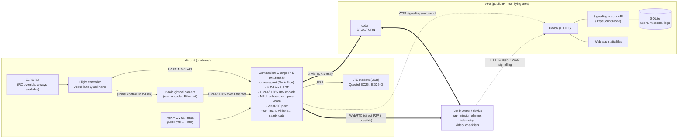

# Architecture

## Goal

A fixed-wing VTOL drone (ArduPlane QuadPlane) that flies **autonomous missions only**. It is supervised over **4G/LTE** from a **password-protected web app**.

- **No manual control is sent to the aircraft.** Only mission tasking and high-level commands go out.
- **Live video downlink** is wanted, but latency isn't the top priority.
- The app must work in **any modern browser on any device**: laptop, Android, iPad or iPhone.

## Approach: WebRTC between the drone and the browser

The browser's only native real-time peer-to-peer channel is **WebRTC**. So the drone runs a WebRTC agent, and the browser connects to it directly:

- **Video track:** hardware H.264 from the drone. Every browser decodes it natively. No server-side transcoding.
- **Data channels:**
  - `telemetry`: unordered, no retransmits (`maxRetransmits: 0`). A dropped packet never delays newer state.
  - `control`: reliable and ordered. Carries mission upload, mode and high-level commands, and acknowledgements.
- **Encryption:** DTLS-SRTP end to end, even when relayed through TURN.

A small VPS still exists, but **media and MAVLink don't pass through application code there**. It provides:

1. **Signalling and auth.** Password login, then it brokers the SDP and ICE exchange between the browser and the drone. The drone keeps a persistent outbound WSS connection to it.
2. **STUN/TURN (coturn).** Cellular CGNAT often blocks a direct peer-to-peer path. TURN relays the encrypted packets when that happens. Order of preference: direct UDP, then TURN/UDP, then TURN/TLS as a last resort.
3. **Web app hosting**, plus storage for missions and flight logs. The drone uploads logs after landing.

## Diagram

## Session flow

1. The drone boots, brings up LTE, and opens a WSS to the signalling server. It authenticates with a **per-drone key**.
2. The operator logs in (argon2id password, plus TOTP later). They get a session cookie.
3. The operator opens the drone page. The server mints a **short-lived signed session token** (Ed25519, carrying the user, role and expiry) and forwards it to the drone with the browser's SDP offer.
4. The drone **verifies the token itself** before answering. It never accepts a peer the server didn't authorise.
5. ICE finds the best path. The drone streams video and telemetry, and accepts commands on the `control` channel.
6. One **commander** session is allowed at a time. Extra sessions are view-only and limited by the drone's uplink, so cap them at 2–3 viewers. Add an SFU later if more are needed.

## Command model (no manual control)

The `control` channel accepts a fixed set of JSON messages. The **drone agent** turns them into MAVLink and enforces the rules. The server can't, because it's not in the data path.

| Command | Notes |
|---|---|
| `mission.upload` | The agent runs the MAVLink mission protocol (with retries) and reads the mission back to verify it. |
| `mission.start` | Requires pre-flight checks passed, the vehicle armed, and the mission verified. |
| `arm` / `disarm` | Arm only on the ground, with the pre-flight checklist done. Disarm only when landed. |
| `mode.pause` | Switch to LOITER/QLOITER |
| `mode.resume` | Back to AUTO |
| `mode.rtl` | RTL; QuadPlane VTOL landing via `Q_RTL_MODE` |
| `mode.qland` | Land vertically now |
| `video.config` | Bitrate and resolution presets |

No RC override, no `MANUAL_CONTROL`, no direct attitude or velocity setpoints. These are **blocked in the agent**. The agent also logs every command locally in its flight log (`agent/README.md`), with signed user identity once session tokens carry it (today: the session id), and uploads the logs later.

## Safety model

- **The aircraft must be safe with no link.** ArduPilot flies the mission. The link is for supervision only.
- **The link never changes what the aircraft does (ADR-0020).** It's for planning and watching. The whole mission is uploaded before flight and flown from the FC's own memory; nothing streams up during it. There is no GCS failsafe (`FS_GCS_ENABL 0`): connecting, disconnecting or losing LTE has no effect on the flight. Only explicit commands (pause, resume, RTL, QLAND) change it.
- **Pauses can't strand the aircraft.** A browser pause ends by itself after 120 s, when `pause_resume.lua` on the FC resumes the mission. Any resume rejoins the planned leg rather than flying a new line from wherever the aircraft is.
- Geofence (`FENCE_*`), altitude limits and the battery failsafe are all **on the FC**.
- **RC override is always available** (ADR-0008). See the next section.

## RC override (local radio)

An ELRS receiver is wired directly to the FC, and it **always** has authority over the browser.

- **Taking over:** ArduPilot changes mode when the RC mode switch *changes position*. The pilot flips the switch to FBWA, QHOVER or QLOITER (or RTL/QLAND), and that takes over at once, whatever the browser commanded. The browser then sees the mode change and the "RC override active" flag in telemetry.
- **Handing back:** the pilot switches back to AUTO on the radio, or the browser sends `mode.resume` once the operator acknowledges it. The browser *cannot* leave a manual mode the pilot picked unless the pilot releases it. The agent refuses mode commands while the RC switch is off its AUTO position (reported as `rc.modeSwitch`), and while the FC is in a pilot mode the agent didn't command.
- **RC failsafe must not abort autonomy.** Beyond radio range the RC link is normally lost. Set `FS_LONG_ACTN` and `THR_FAILSAFE` so that losing RC **in AUTO continues the mission**. Losing the cellular link does nothing (ADR-0020). Losing RC while not in AUTO → RTL with a VTOL landing.
- **Pre-flight check:** the RC link is present and the mode switch is in the AUTO position before a mission starts from the browser. The agent checks this on `mission.start` (`preflight_failed` otherwise), and the browser's checklist shows it. So the radio needs a switch position set to AUTO in `FLTMODE1..6`.
- The RC link is not routed through the companion computer, so an agent, modem or VPS failure can't affect it.
- MAVLink2 signing between the agent and the FC, to be added during hardening.

## Video

- **One live stream** over the cellular link at a time (ADR-0018): the gimbal camera by default, or an aux camera the operator cycles to. CV cameras never stream; their results go over the `telemetry`/`control` channels.
- The gimbal camera encodes itself (H.264/H.265 over Ethernet), and the agent forwards it into the WebRTC track without transcoding. Aux cameras use the Orange Pi 5's hardware encoder (RK3588S, GStreamer `mpph264enc`).
- Start at 720p30 and 1–2 Mbps, adaptive via WebRTC congestion feedback.
- If the uplink is poor, drop resolution first, then frame rate. Telemetry always takes priority over video.
- Option: record full quality onboard (to SD) and upload it after landing.

## Why this over QuadroFleet / WireGuard

QuadroFleet uses WireGuard and raw UDP into a native app. A browser can do neither, so we would need a server that **translates** video and MAVLink, which adds a hop and transcoding. WebRTC end to end is browser-native on every device, and it's encrypted and congestion-controlled. It also goes direct whenever the network allows. We borrow QuadroFleet's hardware lessons: the Quectel modem and power sizing.
