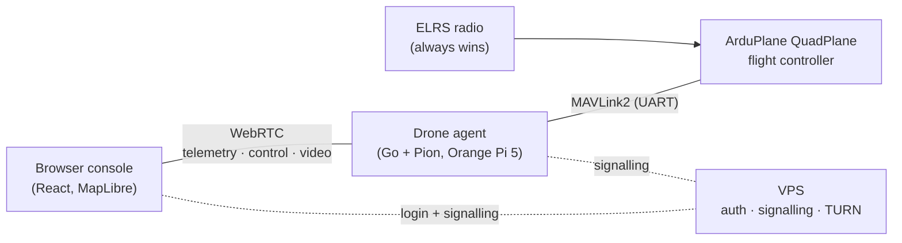

# Cellular VTOL drone

A fixed-wing **VTOL (ArduPlane QuadPlane)** that flies **autonomous missions only**, supervised over **4G/LTE** from a password-protected browser app. Live video and telemetry come down; **no manual control goes up**. A local ELRS radio can always take over (ADR-0008).

## Where to start

- **[Status](status.md)**: what's done, what's next, and what's waiting on hardware, with progress counted straight from the plan.
- **[Progress log](progress-log.md)**: what each working session delivered, by date.
- **[Plan](PLAN.md)**: the phased checklist. The one place items get ticked off.
- **[Decisions](DECISIONS.md)**: the ADRs: why things are the way they are.

## The rules that shape everything

- **The aircraft is safe with no link.** The whole mission lives on the flight controller; losing LTE, the browser or the companion computer never changes the flight (ADR-0020).
- **ArduPilot is the reference.** Every mission item, command and telemetry field maps onto ArduPlane / MAVLink2 ([mapping](MAVLINK.md), ADR-0017). Where the mock and SITL disagree, SITL is right.
- **Frontend first, against a mock.** The UI only talks to the `VehicleLink` interface, so the same screens run on the in-browser mock, SITL and the real drone ([frontend contract](FRONTEND.md), ADR-0009).
- **Software in the simulator before hardware, hardware on the bench before flying.**

## Running things

| What | Command |
| --- | --- |
| Web console against the mock | `cd web && npm run dev` |
| ArduPlane SITL | `cd sim && docker compose up -d` |
| Agent against SITL | `cd agent && go run ./cmd/agent -fc tcp:127.0.0.1:5760 -video-cmd ""` |
| Browser → agent → SITL e2e | `cd web && npm run e2e:sitl` |
| This site | `pip install -r requirements-docs.txt && mkdocs serve` |

Public mock demo: <https://drone.tomwildoer.com>.
